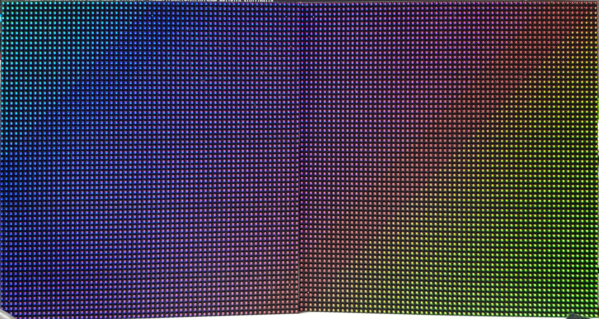

# LED panel using PIO state machine and Direct Memory Access

This code shows how a pio state machine can drive led panels. It is made for
two 64x64 led panels connected to form a 64 row x 128 column panel. There are 16
brightness levels for each Red, Green and Blue of each pixel, allowing many 
colors. In its present form it updates the panel at about 144 Hz at standard
clock settings (=125MHz.)

The main function has code for three test patterns.

The user prepares an image (variable 'image') and then encodes it to a
version that is suitable for the pio state machine (sm) to display.
The pio state machine (sm) continuously updates the display via direct 
memory access (DMA).

